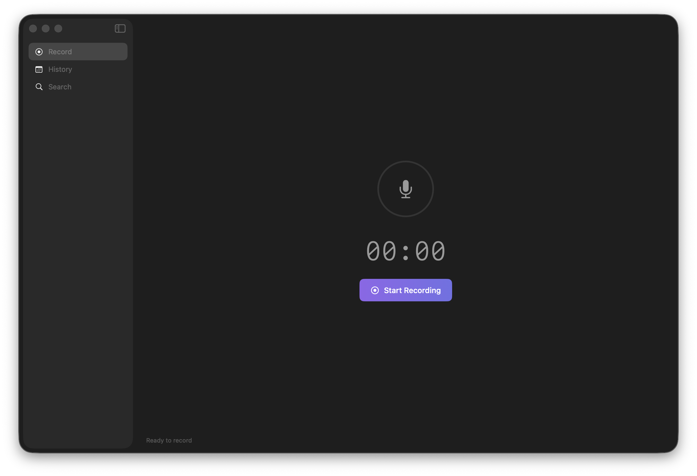

# Nudge Pro

Record meetings silently, without clicking anything.



## Why I built it

Every meeting recorder I tried required me to do something — open an app, hit record, remember to stop it. I wanted the opposite: something that notices when a meeting starts, handles everything in the background, and has notes waiting for me when I'm done.

Nudge Pro lives in your menu bar and auto-detects when Zoom, Teams, or Google Meet launches. It starts recording, transcribes locally, and generates a summary — without you touching a thing.

## Features

- **Audio Recording** - Record meeting audio using microphone and system audio
- **Transcription** - Automatic speech-to-text using Apple's Speech framework with Whisper fallback
- **AI Meeting Notes** - Generate summaries and action items using LLM
- **Session Detail View** - Per-session view with notes, action items, and transcripts
- **Session History** - Browse and search past meetings
- **Export** - Export notes as Markdown, Plain Text, or JSON
- **Menu Bar Integration** - Quick recording controls in macOS menu bar
- **Meeting Detection** - Auto-detects Zoom, Teams, and Google Meet launches

## Supported LLM Providers

- **Ollama** (default) - Free, runs locally
- **OpenAI** - GPT-4, GPT-3.5
- **Anthropic** - Claude
- **Custom** - Any OpenAI-compatible API (e.g., LM Studio)

## Requirements

- macOS 13.0+
- Microphone permission
- Screen Recording permission (for system audio)
- Speech Recognition permission (for transcription)

## Installation

1. Clone the repository
2. Open `NudgePro.xcodeproj` in Xcode
3. Build and run (Cmd+R)

### Setting up Ollama (recommended)

```bash
# Install Ollama
curl -fsSL https://ollama.com/install.sh | sh

# Pull a model
ollama pull llama3.2:latest

# Start Ollama
ollama serve
```

## Usage

1. **First Launch** - Complete onboarding to grant permissions
2. **Record** - Click the record button to start recording
3. **Stop** - Click stop to end recording (processing happens in background)
4. **View Notes** - Check History for transcriptions and AI-generated notes

## Keyboard Shortcuts

- `Cmd+Shift+R` - Start Recording
- `Cmd+Shift+S` - Stop Recording
- `Cmd+Shift+O` - Reopen onboarding

## Architecture

```
NudgePro/
  App/            - App entry, app delegate, state
  Design/         - Design tokens (delegates to Theme.swift)
  Domain/         - Entities, enums, errors, protocols
  Infrastructure/ - Services (LLM, recording, storage, keychain)
  Localization/   - UI string constants
  Presentation/   - ViewModels + Views
```

## Security

- **API keys stored in macOS Keychain** - OpenAI, Anthropic, and Custom provider keys are stored securely using the Keychain, not in plaintext UserDefaults
- **Network timeouts** - All LLM requests have 30s request timeout and 60s resource timeout
- All recordings stored locally on your Mac
- Transcription uses Apple's on-device Speech framework
- AI processing runs locally (Ollama) or via your API keys (OpenAI/Anthropic)
- No data sent to external servers unless you use cloud AI providers

## Privacy

- All recordings stored locally in `~/Documents/Nudge Sessions/`
- Transcription uses Apple's on-device Speech framework with optional Whisper fallback
- AI processing runs locally (Ollama) or via your API keys (OpenAI/Anthropic)
- No analytics, no telemetry, no tracking

## License

The app is free to download and use. The source code is not licensed for reuse or redistribution.
